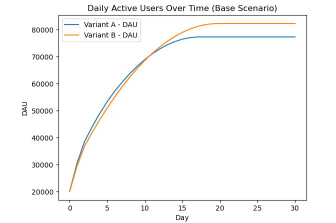
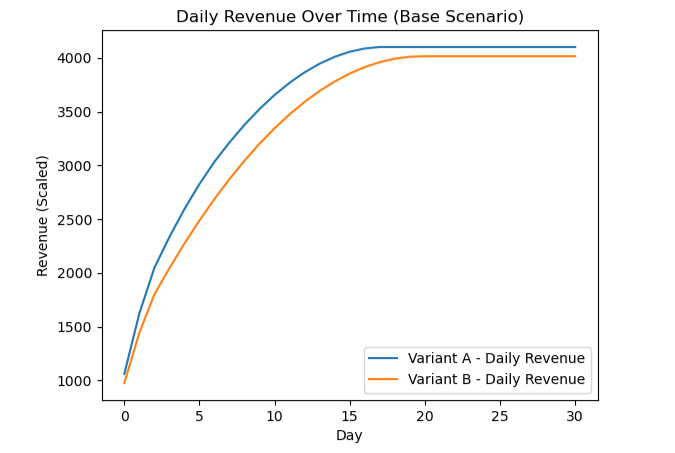

\# Vertigo Games – Data Analyst Case  

\## Task 1: A/B Test Modeling \& Simulation

\### Overview

This repository contains the solution for \*\*Task 1\*\* of the Vertigo Games Data Analyst case study.  

The objective of this task is to compare two difficulty flow variants (A and B) by simulating user behavior and monetization performance over time.

The analysis focuses on \*\*user retention, daily active users (DAU), and revenue generation\*\*, using the metrics provided in the case description.

---

\## Problem Description

Each variant receives \*\*20,000 new installs per day\*\*.  

The following metrics are provided for both variants:

\- Daily Purchase Ratio  

\- eCPM  

\- Ad Impressions per DAU  

\- Retention at D1, D3, D7, and D14  

Using these inputs, the task evaluates short-term and long-term performance under multiple scenarios.

---

\## Methodology

\### Retention Modeling

Retention is modeled at a \*\*daily level\*\* by linearly interpolating between the given checkpoints (D1, D3, D7, D14).

\- Retention on Day 0 is assumed to be 100%

\- Retention after Day 14 is extrapolated using the last observed decay trend

\- All retention values are bounded between 0 and 1

This approach produces a smooth and interpretable retention curve suitable for simulation.

---

\### DAU Simulation

Daily Active Users are calculated using a \*\*cohort-based approach\*\*:

\- A new cohort of users is added each day

\- Each cohort contributes to DAU based on its age-specific retention

\- DAU is the sum of all active cohorts on a given day

This method reflects how DAU evolves in real-world free-to-play games.

---

\### Monetization Modeling

Two revenue streams are considered:

\#### In-App Purchases (IAP)

\- Daily buyers are estimated using the daily purchase ratio

\- ARPPU is assumed to be constant (set to 1.0) since the analysis focuses on \*\*relative comparison\*\*, not absolute revenue

\#### Advertising Revenue

\- Ad impressions are derived from DAU and impressions per DAU

\- Revenue is calculated using the provided eCPM values

Total daily revenue is the sum of IAP and advertising revenue.

---

\## Scenarios \& Results

\### (a) DAU After 15 Days

The DAU values of both variants are compared on Day 15.

\*\*Result:\*\*  

The variant with stronger early retention maintains a higher DAU after 15 days.

---

\### (b) Total Revenue by Day 15

Cumulative revenue is calculated from Day 0 to Day 15.

\*\*Result:\*\*  

Short-term monetization favors the variant with higher purchase efficiency and ad yield.

---

\### (c) Total Revenue by Day 30

The same analysis is extended to a 30-day horizon.

\*\*Result:\*\*  

When long-term effects are considered, the preferred variant may change due to retention compounding.

---

\## Key Visuals

\### DAU Trend (Base Scenario, Day 0–30)

\### Daily Revenue Trend (Base Scenario, Day 0–30)

---

\### (d) Temporary Sale (Day 15–24)

A 10-day sale is simulated by increasing the purchase rate by \*\*+1%\*\* during the campaign period.

\*\*Result:\*\*  

The sale produces a noticeable short-term revenue uplift, but its impact does not persist after the campaign ends.

---

\### (e) New User Source Added on Day 20

From Day 20 onward:

\- 12,000 users arrive from the original source

\- 8,000 users arrive from a new source with different retention dynamics

The new source retention follows an exponential decay model as defined in the case.

\*\*Result:\*\*  

Adding a permanent user source increases DAU sustainably and compounds revenue over time.

---

\### (f) Prioritization Decision

If only one improvement could be prioritized, adding the \*\*new, permanent user source\*\* would be the preferred option.

While the temporary sale boosts monetization in the short term, its effect is limited to the campaign duration.  

In contrast, the permanent user source strengthens the core growth loop by continuously increasing DAU, positively affecting both ad and IAP revenue.

---

\## Key Assumptions

\- Install volume is constant unless explicitly stated otherwise

\- ARPPU is fixed across variants

\- Retention behavior is consistent within each acquisition source

\- No interaction effects between retention and monetization are assumed

All assumptions are applied equally to ensure a fair comparison.

---

\## Files Included

\- `task1\_simulation.ipynb` – Full simulation and analysis  

\- `README.md` – Summary of methodology, assumptions, and results  

\- `images/` – Screenshots of key visualizations  

---

\## Conclusion

This analysis demonstrates how limited aggregate metrics can be transformed into a structured simulation to support \*\*data-informed product decisions\*\*.  

By combining retention modeling, cohort-based DAU simulation, and monetization logic, the task highlights the importance of long-term thinking when evaluating A/B test results.

# Task 2 — Exploratory Data Analysis & User Segmentation

This notebook focuses on exploratory data analysis of user behavior and monetization using the provided event-level dataset.

The goal of this task is to understand how user engagement and revenue evolve over the user lifecycle and to extract meaningful insights that could inform product and monetization strategies.

---

## Dataset Overview

The dataset consists of multiple compressed CSV files (`.csv.gz`) containing daily user-level metrics, including:

- Installation and event dates
- Platform and country information
- Session activity and match outcomes
- In-app purchase (IAP) revenue
- Ad revenue

All files share the same schema and are combined into a single dataset for analysis.

---

## Analysis Approach

The analysis follows a structured and transparent workflow:

1. **Data Loading**
   - All `.csv.gz` files are dynamically loaded and merged into a single DataFrame.

2. **Data Validation & Cleaning**
   - Invalid lifecycle records (events occurring before install) are removed.
   - Infinite values caused by division operations are handled.
   - Missing categorical values (e.g., country) are labeled as "Unknown".

3. **Feature Engineering**
   - Days since install
   - Average session duration per session
   - Match win rate

4. **Lifecycle Segmentation**
   - Users are segmented based on time since installation:
     - D0–D1
     - D2–D7
     - D8–D30
     - D31–D90
     - D90+

5. **Aggregation & Visualization**
   - Engagement and monetization metrics are aggregated by lifecycle segment.
   - Visualizations highlight trends in session duration and revenue.

---

## Key Insights

- User engagement increases steadily as users progress through lifecycle stages, with long-term users spending significantly more time per session.
- In-app purchase revenue peaks in mid-to-late lifecycle stages (D8–D90), indicating higher spending propensity among engaged users.
- Ad revenue remains relatively stable but slightly declines for long-term users, suggesting a shift toward IAP-driven monetization.
- Win rate decreases over time, which may indicate increasing game difficulty or matchmaking adjustments for experienced users.

---

## Files in This Repository

- `task2_eda.ipynb` — Jupyter Notebook containing the full analysis
- `README.md` — Overview of the analysis and key findings

---

## Notes

This analysis is exploratory in nature and aims to demonstrate analytical thinking, data handling, and insight generation rather than model optimization.

